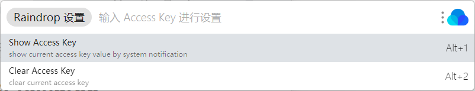
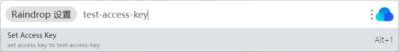
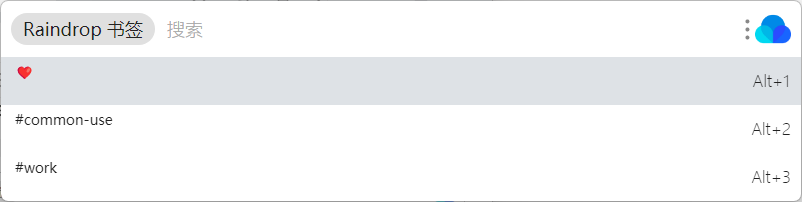
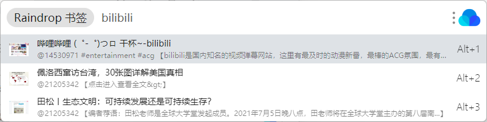
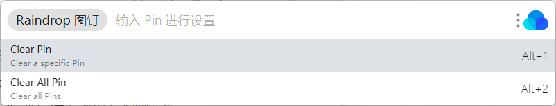

# utools-raindrop

在 utools 中查询 Raindrop.io 书签服务。

## 功能列表

### AccessKey 设置

使用`Raindrop 设置`进入子菜单，默认可以查看或清理当前设置的 AccessKey。

在子菜单中继续输入，可以设置 AccessKey。

AccessKey 需要在 [Raindrop.io](https://app.raindrop.io/settings/integrations) 中自行创建（绝对不是我偷懒没适配 OAuth( •̀ ω •́ )✧）

### Raindrop 查询

使用 `Raindrop 书签`进入子菜单，默认展示你设置的 Pin。

在子菜单中继续输入进行查询，可以使用 Raindrop.io 支持的[各种语法](https://help.raindrop.io/using-search)。**使用 @collectionId 开头可以指定使用的收藏集**

### Raindrop Pin

使用`Raindrop 图钉`进入子菜单，管理你的 Pin，方便保存常用的查询语句。

在子菜单中继续输入，可以添加新的 Pin。**使用 @index 开头可以指定插入位置**

